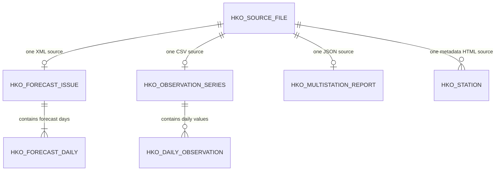

# HKO PostgreSQL/PostGIS Database Guide for Coding Agents

**Database:** `course_project`  
**Primary schema:** `project`  
**Database engine:** PostgreSQL with PostGIS  
**Context version:** 2026-10-04
**Audience:** COMP3522 project teammates and their coding agents

This is the canonical working guide for querying the course-project database.
It describes the schema created by `HKO-Schema.sql`, how the importer converts
the source files, which tables to use for common questions, and the analytical
caveats that must be preserved in generated code.

## Instructions for coding agents

When helping a teammate:

1. Read this document before writing SQL or Python for this database.
2. Default to read-only `SELECT` queries. Do not run `INSERT`, `UPDATE`,
   `DELETE`, `ALTER`, `DROP`, or `TRUNCATE` unless the user explicitly requests
   a database change and its scope is clear.
3. Fully qualify project objects as `project.object_name`, even though team
   accounts normally use `project, public` as their search path.
4. Never request, print, log, commit, or hard-code a database password. Read
   connection settings from environment variables.
5. Use parameterized SQL. Do not interpolate user-supplied values into SQL.
6. Select only necessary columns and always constrain large fact queries by a
   date range, series, station, or other relevant filter.
7. Inspect the live schema when behavior depends on the current deployment;
   this file describes the intended schema but is not a substitute for checking
   a changed database.
8. Preserve `source_file_id` or `source_relative_path` when an analysis needs
   reproducible provenance.
9. Treat the interpretation and leakage rules in this guide as mandatory unless
   the project team explicitly changes the research design.
10. After any authorized database modification, refresh this guide's live-schema
    snapshot from the committed live catalog and check the import status.
    Follow `AGENTS.md`; do not mark database work complete with stale schema
    documentation. Refresh this guide too when meanings or usage rules change.

## Connection contract

| Setting | Value or rule |
| --- | --- |
| Host from teammates' computers | `100.85.176.85` through Tailscale |
| Host from the database desktop | `localhost` is preferred |
| Port | `5432` |
| Database | `course_project` |
| Schema | `project` |
| User | Each teammate's own account: `harrison`, `tony`, or `sena`; the host owner uses `project_admin` |
| Password | The password belonging to that user; never the `postgres` administrator password |
| Network requirements | Host desktop, PostgreSQL, and Tailscale must be running; NordVPN must not block Tailscale traffic |

Recommended environment variables:

```text
PGHOST=100.85.176.85
PGPORT=5432
PGDATABASE=course_project
PGUSER=<your-own-database-username>
PGPASSWORD=<your-own-database-password>
```

Store these in the operating-system environment or an untracked `.env` file.
If using `.env`, add it to `.gitignore` before creating it.

Basic connection check:

```sql
SELECT
    current_database() AS database_name,
    current_user AS database_user,
    current_setting('search_path') AS search_path,
    PostGIS_Full_Version() AS postgis_version;
```

## Database scope and evidence coverage

- The database contains public HKO 9-day forecast vintages and official daily
  observations, mainly for 2022-01-01 through 2025-12-31.
- Some observation CSV files contain older historical records. Code must apply
  the intended study period explicitly rather than assuming all rows lie within
  2022-2025.
- The source inventory, forecast, observation, report, and station structures
  are defined by the inspected schema and importer scripts.
- Forecast and measurement interpretation is based on the supplied HKO dataset
  README. Definitions of every upstream HKO field and every completeness code
  were not present in the inspected sources; see **Open questions**.

Expected rows from the prepared import are shown below for validation, not as
permanent constants:

| Object | Expected rows after the initial complete import |
| --- | ---: |
| `project.hko_source_file` | 7,277 |
| `project.hko_forecast_issue` | 5,660 |
| `project.hko_forecast_daily` | 50,940 (nine rows per issue) |
| `project.hko_observation_series` | 151 |
| `project.hko_daily_observation` | 1,677,477 |
| `project.hko_multistation_report` | 1,461 |
| `project.hko_station` | 93 |

Always query live counts when correctness depends on import completion.

## Entity relationships


```mermaid
erDiagram
    HKO_SOURCE_FILE ||--o| HKO_FORECAST_ISSUE : "one XML source"
    HKO_FORECAST_ISSUE ||--|{ HKO_FORECAST_DAILY : "contains forecast days"
    HKO_SOURCE_FILE ||--o| HKO_OBSERVATION_SERIES : "one CSV source"
    HKO_OBSERVATION_SERIES ||--o{ HKO_DAILY_OBSERVATION : "contains daily values"
    HKO_SOURCE_FILE ||--o| HKO_MULTISTATION_REPORT : "one JSON source"
    HKO_SOURCE_FILE ||--o{ HKO_STATION : "one metadata HTML source"
```

Main join rules:

| From | To | Join |
| --- | --- | --- |
| Forecast issue | Source provenance | `hko_forecast_issue.source_file_id = hko_source_file.source_file_id` |
| Forecast day | Forecast issue | `hko_forecast_daily.forecast_issue_id = hko_forecast_issue.forecast_issue_id` |
| Observation series | Source provenance | `hko_observation_series.source_file_id = hko_source_file.source_file_id` |
| Daily observation | Observation series | `hko_daily_observation.observation_series_id = hko_observation_series.observation_series_id` |
| Multistation report | Source provenance | `hko_multistation_report.source_file_id = hko_source_file.source_file_id` |
| Station | Source provenance | `hko_station.source_file_id = hko_source_file.source_file_id` |

There is currently no enforced foreign key between an observation's
`station_name` and `hko_station.station_code` or `station_name`. Do not invent
that join. Normalize and validate station names before a spatial join.

## Tables

### `project.hko_source_file`

**Grain:** one imported source file.  
**Use:** provenance, archive timestamps, checksums, file type, and traceability.

| Column | PostgreSQL type | Null? | Key/default | Meaning |
| --- | --- | --- | --- | --- |
| `source_file_id` | `bigint` | No | Identity primary key | Internal source-file identifier used by all child tables. |
| `dataset_name` | `text` | No |  | Importer classification, such as `historical_weather_forecast` or `actual_weather_observation`. |
| `source_kind` | `text` | No |  | File role: `forecast_xml`, `observation_csv`, `multistation_report_json`, `forecast_manifest_json`, `station_metadata_html`, or `other`. |
| `relative_path` | `text` | No | Unique | Path relative to the HKO dataset root. This is the strongest human-readable provenance locator. |
| `file_extension` | `text` | No |  | Lowercase extension such as `.xml`, `.csv`, `.json`, or `.html`. |
| `retrieved_at_utc` | `timestamptz` | Yes |  | UTC archive-retrieval time parsed from the filename. It is not forecast issue time. |
| `sha256_prefix` | `text` | Yes |  | Checksum prefix embedded in the archive filename; not necessarily the complete SHA-256 digest. |
| `size_bytes` | `bigint` | No | Check `>= 0` | Original source-file size. |
| `imported_at` | `timestamptz` | No | Default `now()` | Time at which this source row was last inserted or refreshed. |

### `project.hko_forecast_issue`

**Grain:** one archived HKO public 9-day forecast bulletin/vintage.  
**Use:** issue-time metadata and bulletin-level text.

| Column | PostgreSQL type | Null? | Key/default | Meaning |
| --- | --- | --- | --- | --- |
| `forecast_issue_id` | `bigint` | No | Identity primary key | Internal forecast-vintage identifier. |
| `source_file_id` | `bigint` | No | Unique FK to `hko_source_file`, cascade delete | XML source containing this bulletin. |
| `bulletin_time_hkt` | `timestamp without time zone` | No |  | Bulletin update timestamp interpreted as Hong Kong time. Python receives a naive datetime; localize it to `Asia/Hong_Kong` when necessary. |
| `published_time_utc` | `timestamptz` | Yes |  | RSS `pubDate`, stored as an absolute timestamp. |
| `title` | `text` | No |  | Original bulletin title. |
| `general_situation` | `text` | Yes |  | Parsed general-situation narrative. |
| `raw_description` | `text` | No |  | Complete original RSS description content retained for audit/reparsing. |

### `project.hko_forecast_daily`

**Grain:** one valid date within one forecast issue.  
**Primary key:** (`forecast_issue_id`, `valid_date`).  
**Use:** forecast verification, lead-time analysis, revision analysis, and
forecast weather-text analysis.

| Column | PostgreSQL type | Null? | Key/default | Meaning |
| --- | --- | --- | --- | --- |
| `forecast_issue_id` | `bigint` | No | PK; FK to `hko_forecast_issue`, cascade delete | Forecast vintage that produced the daily prediction. |
| `valid_date` | `date` | No | PK | Calendar date to which the prediction applies. |
| `lead_days` | `integer` | No |  | Whole calendar-day difference between `valid_date` and the HKT bulletin date. |
| `wind` | `text` | Yes |  | Parsed forecast wind description. |
| `weather` | `text` | Yes |  | Parsed forecast weather description. |
| `forecast_tmin_c` | `numeric` | Yes |  | Forecast minimum temperature in degrees Celsius. |
| `forecast_tmax_c` | `numeric` | Yes |  | Forecast maximum temperature in degrees Celsius. |
| `forecast_rh_min_pct` | `numeric` | Yes |  | Forecast minimum relative humidity percentage. |
| `forecast_rh_max_pct` | `numeric` | Yes |  | Forecast maximum relative humidity percentage. |
| `psr` | `text` | Yes |  | HKO probability-of-significant-rain descriptor as published, commonly categorical text. Do not assume it is a numeric probability. |

Index: B-tree on `valid_date`.

### `project.hko_observation_series`

**Grain:** one imported observation CSV/measurement series.  
**Use:** describes the station, measurement, and unit for rows in
`hko_daily_observation`.

| Column | PostgreSQL type | Null? | Key/default | Meaning |
| --- | --- | --- | --- | --- |
| `observation_series_id` | `bigint` | No | Identity primary key | Internal series identifier. |
| `source_file_id` | `bigint` | No | Unique FK to `hko_source_file`, cascade delete | CSV source for the series. |
| `series_code` | `text` | No |  | Stable import code derived from the source directory, e.g. `obs_hko_daily_tmax`. |
| `title_zh` | `text` | Yes |  | Original Chinese series title. |
| `title_en` | `text` | No |  | Original English series title. |
| `station_name` | `text` | Yes |  | Best-effort station name parsed from the English title. Null for a non-station or unparsed series. |
| `metric_name` | `text` | No |  | Measurement description parsed from the title. |
| `unit` | `text` | Yes |  | Unit parsed from parentheses in the title; verify unusual series against `title_en`. |

Important initial series codes include:

| Series code | Intended measurement |
| --- | --- |
| `obs_hko_daily_tmax` | HKO Headquarters daily maximum temperature |
| `obs_hko_daily_tmin` | HKO Headquarters daily minimum temperature |
| `obs_hko_daily_rainfall` | HKO Headquarters daily total rainfall |
| `obs_spatial_daily_temperature` | Regional-station daily temperature series; use `station_name` and `title_en` to identify station and max/min variant |
| `obs_spatial_daily_rainfall` | Regional-station daily total rainfall; use `station_name` |

Discover rather than guess all available series:

```sql
SELECT
    series_code,
    station_name,
    metric_name,
    unit,
    title_en
FROM project.hko_observation_series
ORDER BY series_code, station_name, title_en;
```

### `project.hko_daily_observation`

**Grain:** one observation date within one observation series.  
**Primary key:** (`observation_series_id`, `observation_date`).  
**Use:** canonical normalized fact table for daily CSV measurements.

| Column | PostgreSQL type | Null? | Key/default | Meaning |
| --- | --- | --- | --- | --- |
| `observation_series_id` | `bigint` | No | PK; FK to `hko_observation_series`, cascade delete | Series/station/metric definition. |
| `observation_date` | `date` | No | PK | Date of the observation. |
| `value_text` | `text` | Yes |  | Original HKO value, preserved exactly enough to retain values such as `Trace`. |
| `value_numeric` | `numeric` | Yes |  | Parsed numeric value when `value_text` is a valid number; otherwise null. |
| `data_completeness` | `text` | Yes |  | Original HKO completeness marker. Do not assume unknown markers mean complete. |

Index: B-tree on `observation_date`.

`value_numeric IS NULL` does not necessarily mean missing data. It may mean the
source used a nonnumeric value such as `Trace`. Inspect `value_text` before
excluding or recoding it. Do not automatically convert trace rainfall to zero.

### `project.hko_multistation_report`

**Grain:** one archived daily HKO weather/radiation JSON report.  
**Use:** lossless access to changing or wide JSON fields that are not modeled as
fixed relational columns.

| Column | PostgreSQL type | Null? | Key/default | Meaning |
| --- | --- | --- | --- | --- |
| `report_id` | `bigint` | No | Identity primary key | Internal report identifier. |
| `source_file_id` | `bigint` | No | Unique FK to `hko_source_file`, cascade delete | JSON source file. |
| `report_date` | `date` | Yes |  | Reported observation date, parsed from `ReportTimeInfoDate`. |
| `bulletin_date` | `date` | Yes |  | Bulletin publication date from the JSON. |
| `bulletin_time` | `text` | Yes |  | Original HKO time string, commonly `HHMM`; it is intentionally not assumed to be a complete timestamp. |
| `report_json` | `jsonb` | No |  | Complete original report object. Most readings remain string values inside the JSON. |

Indexes: B-tree on `report_date`; GIN on `report_json`.

Common JSON key patterns include:

- `<StationToken>LocationName`
- `<StationToken>MaxTemp`
- `<StationToken>MinTemp`
- `<StationToken>Microsieverts`
- `HKOReadings...`
- `KingsParkReadings...`
- narrative fields such as `HongKongDesc` and `NoteDesc`

JSON keys may evolve. Query distinct keys before assuming all reports have a
field:

```sql
SELECT DISTINCT key AS field_name
FROM project.hko_multistation_report AS r
CROSS JOIN LATERAL jsonb_object_keys(r.report_json) AS key
ORDER BY field_name;
```

### `project.hko_station`

**Grain:** one HKO weather station code from the station metadata page.  
**Use:** station coordinates, elevation, spatial filtering, and mapping.

| Column | PostgreSQL type | Null? | Key/default | Meaning |
| --- | --- | --- | --- | --- |
| `station_code` | `text` | No | Primary key | HKO station code, e.g. `HKO` or `HKA`. |
| `source_file_id` | `bigint` | Yes | FK to `hko_source_file`, set null on source deletion | Metadata HTML source. Multiple stations can share this source file. |
| `station_name` | `text` | No |  | English station name. |
| `first_operation_date` | `date` | Yes |  | Parsed date of first operation. |
| `elevation_m` | `numeric` | Yes |  | Ground elevation above mean sea level in metres. |
| `latitude` | `double precision` | No |  | Decimal latitude in WGS 84. |
| `longitude` | `double precision` | No |  | Decimal longitude in WGS 84. |
| `geom` | `geometry(Point, 4326)` | No |  | PostGIS point constructed as longitude first, latitude second. |

Index: GiST on `geom`.

## Views

### `project.v_hko_daily_observation`

**Recommended default for ordinary observation analysis.** It joins daily
values to their series definition and source path.

| Column | Type | Meaning |
| --- | --- | --- |
| `observation_date` | `date` | Observation date. |
| `series_code` | `text` | Import/source series code. |
| `station_name` | `text` | Parsed station name. |
| `metric_name` | `text` | Measurement description. |
| `unit` | `text` | Measurement unit. |
| `value_text` | `text` | Original value. |
| `value_numeric` | `numeric` | Parsed numeric value, otherwise null. |
| `data_completeness` | `text` | Original completeness marker. |
| `source_relative_path` | `text` | Provenance path. |

### `project.v_hko_multistation_value`

Expands every top-level JSON property into a long-form row.

| Column | Type | Meaning |
| --- | --- | --- |
| `report_id` | `bigint` | Parent report ID. |
| `report_date` | `date` | Observation/report date. |
| `field_name` | `text` | Original JSON property name. |
| `value_text` | `text` | JSON value represented as text. |
| `value_numeric` | `numeric` | Numeric conversion only when the entire text is a signed integer/decimal; otherwise null. |

This view includes station names and narratives as well as measurements. Filter
`field_name` deliberately; do not treat every row as a numeric observation.

## Analytical definitions

The following metrics are derived during analysis; they are not stored columns.

| Metric | Definition | Unit/window | Required data and caveats |
| --- | --- | --- | --- |
| Forecast error | `forecast_value - observed_value` | Same unit as the measurement, per valid date and bulletin vintage | Keep sign: positive is over-forecast and negative is under-forecast. |
| Absolute error | `abs(forecast_value - observed_value)` | Same unit, per matched case | Requires non-null forecast and observation. |
| Bias | Mean forecast error | Chosen group/window | Report sample count and grouping dimensions. |
| MAE | Mean absolute error | Chosen group/window | For the preliminary temperature design, calculate Tmax and Tmin separately before any pooled summary. |
| RMSE | Square root of mean squared error | Chosen group/window | More sensitive to large errors; report sample count. |
| Forecast revision | Later vintage forecast minus earlier vintage forecast for the same `valid_date` and variable | Degrees C or relevant unit | Define exactly which consecutive or reference vintages are compared. |

For the main temperature verification target, use:

- Forecast: `hko_forecast_daily.forecast_tmax_c` and
  `hko_forecast_daily.forecast_tmin_c`.
- Observation: series codes `obs_hko_daily_tmax` and
  `obs_hko_daily_tmin` at HKO Headquarters.
- Full-day verification: `lead_days BETWEEN 1 AND 9`.

## Required filters and dimensions

### Filters

| Filter | Rule | Why |
| --- | --- | --- |
| Study period | Usually `date >= DATE '2022-01-01' AND date < DATE '2026-01-01'` | Observation tables may include much older history. |
| Full-day temperature verification | `lead_days BETWEEN 1 AND 9` | Lead day 0 can contain partial knowledge of the realized day. |
| Numeric observation analysis | Require `value_numeric IS NOT NULL`, then separately audit excluded `value_text` values | Prevents accidental casting errors and silent loss of `Trace`/markers. |
| Target station | Use the explicit series/station required by the research question | HKO Headquarters is a point station, not a Hong Kong territory average. |
| No-leakage modeling | Use only information demonstrably available at or before `bulletin_time_hkt` | Daily realized weather/rain/humidity/wind/sunshine is normally post-event context. |

### Dimensions

| Dimension | Source | Meaning/use |
| --- | --- | --- |
| Forecast issue/vintage | `forecast_issue_id`, `bulletin_time_hkt` | Distinguishes multiple forecasts for the same valid date. |
| Lead day | `hko_forecast_daily.lead_days` | Calendar-day forecast horizon. |
| Valid/observation date | `valid_date`, `observation_date`, `report_date` | Join key for forecast verification after matching the correct series. |
| Station | `station_name` or validated `station_code` | Spatial/measurement location; names require normalization before cross-table joins. |
| Measurement | `series_code`, `metric_name`, `unit` | Identifies the observed variable and unit. |
| Season/year | Derive from the valid/observation date | Document the season convention; do not silently mix issue-date and valid-date seasons. |
| Retrieval time | `retrieved_at_utc` | Provenance only; not forecast lead time. |

## Critical interpretation rules and pitfalls

### Part 1 measurement availability verified 2026-10-04

Read-only inspection of the live observation catalog and 2022–2025 records
confirmed complete HKO Headquarters daily Tmax/Tmin observations and daily
**mean** RH (`obs_hko_daily_mean_rh`). The normalized CSV catalog has no daily
RH extrema series, but this is NOT an absence of extrema in the database.
All 1,461 retained `hko_multistation_report` JSON reports contain numeric
`HKOReadingsMinRH` and `HKOReadingsMaxRH` at HKO Headquarters. These fields
are daily minimum/maximum RH (%) under the
[HKO API definitions](https://data.weather.gov.hk/weatherAPI/doc/HKO_Open_Data_API_Documentation.pdf),
printed pages 36–37. Forecast errors are in percentage points, not percent change.

Join forecast `valid_date` to report `report_date`, verified against
`ReportTimeInfoDate` (YYYYMMDD), NOT `bulletin_date`. Each report is published
the next day; 1,456 of 1,461 retained bulletin times are `0015`, with five later
times. There is one report per observation date across 2022–2025. All endpoints
pass numeric, 0–100 and min≤max checks; all report temperature extrema match
the complete CSV temperatures for the same day, and mean RH lies within the
reported RH extrema on every day. These cross-checks are sanity evidence,
not proof of finalized RH observations. All retained reports' `NoteDesc3`
explicitly marks the displayed data as provisional with limited validation.
JSON reports carry no CSV-style `C` completeness marker: retain that source
distinction and audit exclusions. These are HKO-point verification targets,
not a measured territory-wide humidity range.
Preserve report/source-file provenance; there is no RH CSV series foreign key.
The reproducible audit is `analyses/05_rq4_accuracy_by_lead/audit_rh_sources.py`.

Mean RH must never substitute for either RH endpoint. Mean-within-forecast-range
is a separate consistency diagnostic. RH extrema history here begins in 2022:
the RH seasonal baseline freezes 2022 data and verifies only 2023–2025, unlike
the temperature 1991–2020 normal. Never score the RH reference on its training year.

Past temperature observations from 1991–2020 support an out-of-study frozen
climatology. Historical daily-observation publication timestamps are not stored;
issue-day-minus-1/2 persistence remains a retrospective comparator unless
publication availability is independently established. Realized target-day
rainfall, temperature changes and regional spread remain post-event context.

The RQ6 read-only rainfall-report audit also checked all 1,461 daily JSON
reports. Their only rainfall keys are `HKOReadingsRainfall`,
`HKOReadingsAccumRainfall` and `HKOReadingsAvgRainfall`. Daily numeric rainfall
matches the HKO Headquarters point CSV on all 1,223 comparable dates; it is
not a territorial daily mean. Under the API definitions, accumulated rainfall
is total since 1 January. The average field has no within-year numeric decreases
and reaches 2,431.2 mm each year, a cumulative-like calendar profile inconsistent
with a daily rainfall measure. The exact climatological averaging period is not
established here. Do not threshold either cumulative field at 10 mm for PSR
verification or infer territorial coverage from the word "average". See
`analyses/07_rq6_psr_calibration/audit_rainfall_reports.py` and its aggregate audit.
The new Part 1 analyses are read-only; the generated live schema snapshot and
external-model import status below have not been changed by this analysis work.

1. **The forecast is the public HKO 9-day product, not raw numerical weather
   prediction output.** Do not label it as an NWP-model forecast.
2. **HKO Headquarters Tmax/Tmin is a point-station target.** Do not describe it
   as the territory-wide average temperature of Hong Kong.
3. **Use bulletin time as the forecast issue-time proxy.**
   `hko_source_file.retrieved_at_utc` is an archive retrieval timestamp and must
   not be used to calculate lead time.
4. **Do not use lead day 0 for full-day Tmax/Tmin accuracy.** It may contain
   information from part of the day being predicted. It may still be used for a
   clearly labeled revision-behavior analysis.
5. **Avoid target leakage.** Realized daily weather, rainfall, humidity, wind,
   sunshine, radiation, and cyclone context is post-event information unless a
   timestamped no-leakage design proves availability at forecast issuance.
6. **Preserve forecast vintages.** Multiple bulletins can predict the same
   `valid_date`; never aggregate or deduplicate them without an explicit vintage
   selection rule.
7. **Do not silently replace `Trace` with zero.** Retain the original text and
   document any domain-specific recoding.
8. **Do not assume a null numeric value means the observation is absent.** Check
   `value_text` and `data_completeness`.
9. **Do not directly join station names without inspection.** Punctuation,
   abbreviations, and naming conventions can differ across sources.
10. **Treat preliminary analysis outputs as exploratory.** They are not final
    project conclusions.

## Which object should be used?

| Question | Preferred object(s) |
| --- | --- |
| What did a specific forecast bulletin predict? | `hko_forecast_issue` joined to `hko_forecast_daily` |
| How accurate were forecast Tmax/Tmin values? | Forecast tables plus `v_hko_daily_observation`, filtered to HKO Tmax/Tmin series |
| How accurate were forecast RH min/max values? | Forecast tables plus validated `hko_multistation_report` HKOReadingsMinRH/MaxRH, joined on report_date, not bulletin_date; no CSV completeness flag |
| What was the official daily value for a named CSV series? | `v_hko_daily_observation` |
| Which series/stations/units are available? | `hko_observation_series` |
| What did the wide daily JSON report contain? | `hko_multistation_report` for lossless JSON; `v_hko_multistation_value` for exploration |
| Where are HKO stations located? | `hko_station` |
| Which raw file produced a record? | `hko_source_file`, reached through the relevant `source_file_id` |
| Is a field/table currently present? | `information_schema` and PostgreSQL catalogs, not assumptions |

## SQL query patterns

### Inspect the live schema

```sql
SELECT
    table_name,
    ordinal_position,
    column_name,
    data_type,
    udt_name,
    is_nullable,
    column_default
FROM information_schema.columns
WHERE table_schema = 'project'
ORDER BY table_name, ordinal_position;
```

### Retrieve one observation series

```sql
SELECT
    observation_date,
    station_name,
    metric_name,
    unit,
    value_numeric,
    value_text,
    data_completeness
FROM project.v_hko_daily_observation
WHERE series_code = 'obs_hko_daily_tmax'
  AND observation_date >= DATE '2022-01-01'
  AND observation_date < DATE '2026-01-01'
ORDER BY observation_date;
```

### Match forecast temperature with HKO Headquarters observations

This returns every forecast vintage. Retaining `forecast_issue_id` and
`bulletin_time_hkt` prevents accidental collapse of revisions.

```sql
WITH actual AS (
    SELECT
        observation_date AS valid_date,
        max(value_numeric) FILTER (
            WHERE series_code = 'obs_hko_daily_tmax'
        ) AS observed_tmax_c,
        max(value_numeric) FILTER (
            WHERE series_code = 'obs_hko_daily_tmin'
        ) AS observed_tmin_c
    FROM project.v_hko_daily_observation
    WHERE series_code IN ('obs_hko_daily_tmax', 'obs_hko_daily_tmin')
      AND observation_date >= DATE '2022-01-01'
      AND observation_date < DATE '2026-01-01'
    GROUP BY observation_date
)
SELECT
    i.forecast_issue_id,
    i.bulletin_time_hkt,
    f.valid_date,
    f.lead_days,
    f.forecast_tmax_c,
    a.observed_tmax_c,
    f.forecast_tmax_c - a.observed_tmax_c AS tmax_error_c,
    f.forecast_tmin_c,
    a.observed_tmin_c,
    f.forecast_tmin_c - a.observed_tmin_c AS tmin_error_c
FROM project.hko_forecast_daily AS f
JOIN project.hko_forecast_issue AS i
  ON i.forecast_issue_id = f.forecast_issue_id
JOIN actual AS a
  ON a.valid_date = f.valid_date
WHERE f.lead_days BETWEEN 1 AND 9
ORDER BY i.bulletin_time_hkt, f.valid_date;
```

### Retrieve selected multistation JSON fields

```sql
SELECT
    report_date,
    field_name,
    value_numeric,
    value_text
FROM project.v_hko_multistation_value
WHERE field_name IN (
    'HKOReadingsMaxTemp',
    'HKOReadingsMinTemp',
    'HKOReadingsRainfall'
)
  AND report_date >= DATE '2022-01-01'
  AND report_date < DATE '2026-01-01'
ORDER BY report_date, field_name;
```

### Find stations within a radius

Geography casts make the radius and returned distance use metres.

```sql
SELECT
    station_code,
    station_name,
    elevation_m,
    ST_Distance(
        geom::geography,
        ST_SetSRID(ST_MakePoint(:longitude, :latitude), 4326)::geography
    ) AS distance_m
FROM project.hko_station
WHERE ST_DWithin(
    geom::geography,
    ST_SetSRID(ST_MakePoint(:longitude, :latitude), 4326)::geography,
    :radius_m
)
ORDER BY distance_m;
```

Use the parameter syntax required by the client library; do not substitute the
colon placeholders with string concatenation.

### Validate the import

```sql
SELECT 'source files' AS object_name, count(*) AS row_count
FROM project.hko_source_file
UNION ALL
SELECT 'forecast issues', count(*) FROM project.hko_forecast_issue
UNION ALL
SELECT 'forecast days', count(*) FROM project.hko_forecast_daily
UNION ALL
SELECT 'observation series', count(*) FROM project.hko_observation_series
UNION ALL
SELECT 'daily observations', count(*) FROM project.hko_daily_observation
UNION ALL
SELECT 'multistation reports', count(*) FROM project.hko_multistation_report
UNION ALL
SELECT 'stations', count(*) FROM project.hko_station
ORDER BY object_name;
```

## Python access pattern

Recommended packages for ordinary analysis:

```powershell
python -m pip install "psycopg[binary]" sqlalchemy pandas
```

Add `geopandas` only when the analysis needs geometries:

```powershell
python -m pip install geopandas
```

Create a SQLAlchemy engine without manually embedding or URL-escaping the
password:

```python
from __future__ import annotations

import os

import pandas as pd
from sqlalchemy import URL, create_engine, text


def make_engine():
    url = URL.create(
        drivername="postgresql+psycopg",
        username=os.environ["PGUSER"],
        password=os.environ["PGPASSWORD"],
        host=os.getenv("PGHOST", "100.85.176.85"),
        port=int(os.getenv("PGPORT", "5432")),
        database=os.getenv("PGDATABASE", "course_project"),
    )
    return create_engine(
        url,
        pool_pre_ping=True,
        connect_args={"connect_timeout": 10},
    )


ENGINE = make_engine()


def fetch_hko_tmax(start_date: str, end_date: str) -> pd.DataFrame:
    query = text("""
        SELECT
            observation_date,
            value_numeric AS tmax_c,
            value_text,
            data_completeness
        FROM project.v_hko_daily_observation
        WHERE series_code = :series_code
          AND observation_date >= CAST(:start_date AS date)
          AND observation_date < CAST(:end_date AS date)
        ORDER BY observation_date
    """)
    params = {
        "series_code": "obs_hko_daily_tmax",
        "start_date": start_date,
        "end_date": end_date,
    }
    with ENGINE.connect() as connection:
        return pd.read_sql_query(query, connection, params=params)


if __name__ == "__main__":
    frame = fetch_hko_tmax("2022-01-01", "2026-01-01")
    print(frame.head())
    print(frame.shape)
```

For a potentially large result, use `chunksize`:

```python
query = text("""
    SELECT observation_date, series_code, station_name, value_numeric
    FROM project.v_hko_daily_observation
    WHERE observation_date >= CAST(:start_date AS date)
      AND observation_date < CAST(:end_date AS date)
    ORDER BY observation_date
""")

with ENGINE.connect() as connection:
    chunks = pd.read_sql_query(
        query,
        connection,
        params={"start_date": "2022-01-01", "end_date": "2026-01-01"},
        chunksize=100_000,
    )
    for chunk in chunks:
        # Analyze or write one bounded chunk at a time.
        print(len(chunk))
```

For station geometry:

```python
import geopandas as gpd
from sqlalchemy import text

station_query = text("""
    SELECT station_code, station_name, elevation_m, geom
    FROM project.hko_station
    ORDER BY station_code
""")

with ENGINE.connect() as connection:
    stations = gpd.read_postgis(
        station_query,
        connection,
        geom_col="geom",
    )

print(stations.crs)  # Expected EPSG:4326
```

Python safety rules:

- Pass values through `params`; never build a condition using f-strings, `%`,
  or `+`.
- If table or column identifiers must be dynamic, use a fixed allow-list or
  `psycopg.sql.Identifier`; ordinary value parameters cannot safely represent
  identifiers.
- Do not call `DataFrame.to_sql()` against shared tables unless the team has
  explicitly designed and reviewed the write operation.
- Use half-open date ranges (`>= start`, `< end`) for predictable composition.
- For numeric analysis, retain an audit of rows where `value_numeric` is null
  but `value_text` is present.

## Agent workflow for a new analysis request

1. Restate the target variable, station/geography, valid-date range, and whether
   the question concerns forecasts, observations, or forecast accuracy.
2. Inspect `hko_observation_series` if the requested measurement is not already
   mapped in this document.
3. Choose the narrowest appropriate table or view using the selection table
   above.
4. Write a bounded, parameterized SQL query and show it to the user when the
   choice of vintage, station, or missing-value treatment is consequential.
5. Fetch data into pandas/GeoPandas without loading unrelated columns or dates.
6. Check duplicates, nulls, special `value_text` values, date coverage, units,
   and sample counts before calculating results.
7. Preserve the distinction between issue date, valid date, observation date,
   bulletin date, and archive retrieval time.
8. Report the exact filters and series codes used so teammates can reproduce the
   result.

## Quality checks before analysis

```sql
-- Forecast-date and lead coverage
SELECT
    min(valid_date) AS min_date,
    max(valid_date) AS max_date,
    min(lead_days) AS min_lead,
    max(lead_days) AS max_lead,
    count(*) AS rows
FROM project.hko_forecast_daily;

-- Observation coverage by series
SELECT
    s.series_code,
    s.station_name,
    min(o.observation_date) AS min_date,
    max(o.observation_date) AS max_date,
    count(*) AS rows,
    count(*) FILTER (WHERE o.value_numeric IS NULL) AS nonnumeric_or_null_rows
FROM project.hko_observation_series AS s
JOIN project.hko_daily_observation AS o
  ON o.observation_series_id = s.observation_series_id
GROUP BY s.series_code, s.station_name
ORDER BY s.series_code, s.station_name;

-- Nonnumeric source values that need an explicit treatment decision
SELECT
    s.series_code,
    o.value_text,
    o.data_completeness,
    count(*) AS rows
FROM project.hko_daily_observation AS o
JOIN project.hko_observation_series AS s
  ON s.observation_series_id = o.observation_series_id
WHERE o.value_numeric IS NULL
GROUP BY s.series_code, o.value_text, o.data_completeness
ORDER BY rows DESC, s.series_code;
```

The primary-key constraints prevent duplicate dates within one forecast issue or
observation series. They do not mean a valid date has only one forecast vintage
or that two different series cannot represent related measurements.

## Open questions

| Open question | Why it matters | Resolution |
| --- | --- | --- |
| Has the latest import completed with all expected live row counts? | Staging counts do not prove the transaction committed. | Run the validation query after import. |
| What is the governed mapping from every `station_name` to `station_code`? | Needed for reliable automated spatial joins. | Build and review an explicit mapping table; do not use fuzzy matching silently. |
| What do all values of `data_completeness` mean? | Completeness filtering may change sample populations. | Consult the relevant HKO metadata/source documentation and record the rule. |
| How should `Trace` rainfall be represented for each analysis? | Zero, a small amount, or a separate category produce different summaries. | Decide per research method and document it; preserve `value_text`. |
| Which bulletin vintage should represent a valid date in a single-forecast evaluation? | Several issues can forecast the same date. | Specify the vintage/lead-day selection before aggregating. |
| Which JSON keys are stable across the entire period? | The raw report schema can evolve. | Profile key presence by year before relying on a field. |

## Sources and authority

| Source | Use and authority | Inspection status / limits |
| --- | --- | --- |
| [`HKO-Schema.sql`](./HKO-Schema.sql) | Authoritative intended database tables, columns, constraints, views, and indexes | Inspected 2026-09-18; live database may differ after later migrations. |
| [`Import-HKOData.ps1`](./Import-HKOData.ps1) | Authoritative current parsing, type conversion, provenance, and upsert behavior | Inspected 2026-09-18. |
| HKO dataset `README.md` in the host's source-data folder | Intended analytical scope and essential measurement/leakage cautions | Inspected 2026-09-18; references some provenance folders whose names differ in this curated copy. |
| [SQLAlchemy PostgreSQL dialect](https://docs.sqlalchemy.org/en/20/dialects/postgresql.html) | Official `postgresql+psycopg` connection pattern | Checked 2026-09-18; package APIs may evolve. |
| [pandas `read_sql_query`](https://pandas.pydata.org/docs/reference/api/pandas.read_sql_query.html) | Official DataFrame query and chunking contract | Checked 2026-09-18. |
| [GeoPandas `read_postgis`](https://geopandas.org/en/stable/docs/reference/api/geopandas.read_postgis.html) | Official PostGIS-to-GeoDataFrame reader | Checked 2026-09-18. |
| [Psycopg parameter binding](https://www.psycopg.org/psycopg3/docs/basic/params.html) | Official safe value-parameter guidance | Checked 2026-09-18. |

## Maintaining this guide

This guide is the repository's single schema reference. Its generated live-schema
snapshot is refreshed using
`data_management/model_forecasts/schema_document.py` after every database
modification. The GFS import command refreshes it after schema setup and again
after the import attempt. Human interpretation outside the generated section is
preserved; original HKO definitions above were inspected on 2026-09-18.

### External-model extension

`project.external_model_source` records downloaded forecast subsets, their UTC
run times and forecast hours, source URLs, checksums and retrieval metadata.
`project.external_model_temperature` contains station extractions and joins to
the source table by `source_id` and `project.hko_station` by `station_code`.
Column types, keys, constraints and indexes are listed in the live-schema
snapshot at the end of this guide.
DDL is maintained in `data_management/model_forecasts/schema.sql`.

For this extension, `TMP`/`2t` is instantaneous 2 m temperature; `TMAX`/`TMIN`
are extrema over the stored interval, not automatically HKT calendar-day
extrema. Preserve `step_type`, `interval_start_utc` and `valid_time_utc`.
The grid-point extraction is nearest point, with its distance recorded; do not
assume it is a station measurement or a Hong Kong territory average.
Initialization time and retrieval time do not establish historical publication
time. Keep the manifests and GRIB files with the database backup.

Update this document whenever a migration changes a table, column, constraint,
view, index, parsing rule, canonical series mapping, or important analytical
caveat. Update the context version and source inspection dates, then compare the
document against the live catalog using the schema-inspection query above.

Do not put passwords, authentication tokens, raw personal credentials, or
machine-specific secret files in this guide.

### HQ Grid nowcast extension (2026-10-05 HKT)

Two imported tables support the supplementary [HQ Grid rainfall track](analyses/09_hq_grid_nowcast/README.md).
Native windows have 35,016 rows; daily results have 365 rows.
These counts and the definitions below come from the committed post-import catalog receipt.
The receipt finished at 2026-10-04T16:02:09Z, equivalent to 2026-10-05 HKT.

`available_time_utc` is a conservative archive-capture proxy.
`issue_time_utc` is the forecast update time.
`retrieval_time_utc` records the later historical download.
The native primary key is `(available_time_utc, valid_end_utc)`.
The daily primary key is `date_hkt`.
These tables have no foreign-key joins to the original forecast tables.

The daily table includes matched point-gauge observations and Trace bounds.
Incomplete composites remain NULL; five dates lack 396 minutes.
Join other daily observations on the same HKT date and explicitly selected station/series.
Do not treat the mixed-horizon composite as a day-ahead forecast or PSR probability.

<!-- BEGIN GENERATED LIVE SCHEMA -->
## Live schema snapshot

Live database: `course_project`. Schema: `project`.

Verified at: 2026-10-02T04:22:01+00:00.

Generated by `data_management/model_forecasts/schema_document.py` using
a read-only connection loaded from the repository-root `.env`.
This is the committed live catalog, not a list of proposed migrations.

Human definitions, interpretation and safe query patterns are retained
in the preceding sections of this guide.

Refresh this section after every database modification, including imports.

HQ Grid definitions below use the post-import live catalog receipt from 2026-10-04T16:02:09Z.
Other objects retain their original snapshot date; they were not refreshed during this result-publication task.

### Object inventory

| Object | Kind |
| --- | --- |
| `project.external_model_source` | table |
| `project.external_model_temperature` | table |
| `project.hko_daily_observation` | table |
| `project.hko_forecast_daily` | table |
| `project.hko_forecast_issue` | table |
| `project.hko_grid_nowcast_hq_2025` | table |
| `project.hko_grid_nowcast_hq_daily_2025` | table |
| `project.hko_multistation_report` | table |
| `project.hko_nowcast_daily_rainfall_jan_2025` | table |
| `project.hko_observation_series` | table |
| `project.hko_source_file` | table |
| `project.hko_station` | table |
| `project.v_hko_daily_observation` | view |
| `project.v_hko_multistation_value` | view |

### External-model import status

| Model | Source subsets | First run (UTC) | Last run (UTC) |
| --- | ---: | --- | --- |
| GFS | 5 | 2024-01-01T00:00:00+00:00 | 2024-01-01T00:00:00+00:00 |

Temperature extract rows: **13** (actual count at verification time).

### Live object definitions

#### `project.external_model_source`

Kind: table.

| Column | PostgreSQL type | Nullable | Default / generation |
| --- | --- | --- | --- |
| `source_id` | `uuid` | No |  |
| `provider` | `text` | No |  |
| `model` | `text` | No |  |
| `product` | `text` | No |  |
| `run_time_utc` | `timestamp with time zone` | No |  |
| `forecast_hour` | `integer` | No |  |
| `source_url` | `text` | No |  |
| `index_url` | `text` | No |  |
| `retrieved_at_utc` | `timestamp with time zone` | No |  |
| `subset_relative_path` | `text` | No |  |
| `subset_sha256` | `text` | No |  |
| `subset_size_bytes` | `bigint` | No |  |
| `manifest` | `jsonb` | No |  |
| `imported_at_utc` | `timestamp with time zone` | No | now() |

Constraints (including foreign-key join contracts):

- `external_model_source_forecast_hour_check`: `CHECK (forecast_hour >= 0)`
- `external_model_source_pkey`: `PRIMARY KEY (source_id)`
- `external_model_source_source_url_subset_sha256_key`: `UNIQUE (source_url, subset_sha256)`
- `external_model_source_subset_sha256_check`: `CHECK (length(subset_sha256) = 64)`
- `external_model_source_subset_size_bytes_check`: `CHECK (subset_size_bytes > 0)`

Indexes:

```sql
CREATE UNIQUE INDEX external_model_source_pkey ON project.external_model_source USING btree (source_id);
CREATE UNIQUE INDEX external_model_source_source_url_subset_sha256_key ON project.external_model_source USING btree (source_url, subset_sha256);
CREATE INDEX external_model_source_run_time_idx ON project.external_model_source USING btree (model, run_time_utc, forecast_hour);
```

#### `project.external_model_temperature`

Kind: table.

| Column | PostgreSQL type | Nullable | Default / generation |
| --- | --- | --- | --- |
| `source_id` | `uuid` | No |  |
| `station_code` | `text` | No |  |
| `message_number` | `integer` | No |  |
| `parameter_id` | `integer` | No |  |
| `short_name` | `text` | No |  |
| `parameter_name` | `text` | No |  |
| `step_type` | `text` | No |  |
| `interval_start_utc` | `timestamp with time zone` | No |  |
| `valid_time_utc` | `timestamp with time zone` | No |  |
| `target_latitude` | `double precision` | No |  |
| `target_longitude` | `double precision` | No |  |
| `grid_latitude` | `double precision` | No |  |
| `grid_longitude` | `double precision` | No |  |
| `grid_distance_km` | `double precision` | No |  |
| `extraction_method` | `text` | No |  |
| `source_value` | `double precision` | No |  |
| `source_unit` | `text` | No |  |
| `temperature_c` | `double precision` | No |  |

Constraints (including foreign-key join contracts):

- `external_model_temperature_check`: `CHECK (interval_start_utc <= valid_time_utc)`
- `external_model_temperature_extraction_method_check`: `CHECK (extraction_method = 'nearest_grid_point'::text)`
- `external_model_temperature_grid_distance_km_check`: `CHECK (grid_distance_km >= 0::double precision)`
- `external_model_temperature_message_number_check`: `CHECK (message_number > 0)`
- `external_model_temperature_pkey`: `PRIMARY KEY (source_id, station_code, message_number)`
- `external_model_temperature_source_id_fkey`: `FOREIGN KEY (source_id) REFERENCES external_model_source(source_id)`
- `external_model_temperature_station_code_fkey`: `FOREIGN KEY (station_code) REFERENCES hko_station(station_code)`

Indexes:

```sql
CREATE UNIQUE INDEX external_model_temperature_pkey ON project.external_model_temperature USING btree (source_id, station_code, message_number);
CREATE INDEX external_model_temperature_valid_time_idx ON project.external_model_temperature USING btree (valid_time_utc, station_code);
```

#### `project.hko_daily_observation`

Kind: table.

| Column | PostgreSQL type | Nullable | Default / generation |
| --- | --- | --- | --- |
| `observation_series_id` | `bigint` | No |  |
| `observation_date` | `date` | No |  |
| `value_text` | `text` | Yes |  |
| `value_numeric` | `numeric` | Yes |  |
| `data_completeness` | `text` | Yes |  |

Constraints (including foreign-key join contracts):

- `hko_daily_observation_observation_series_id_fkey`: `FOREIGN KEY (observation_series_id) REFERENCES hko_observation_series(observation_series_id) ON DELETE CASCADE`
- `hko_daily_observation_pkey`: `PRIMARY KEY (observation_series_id, observation_date)`

Indexes:

```sql
CREATE UNIQUE INDEX hko_daily_observation_pkey ON project.hko_daily_observation USING btree (observation_series_id, observation_date);
CREATE INDEX hko_daily_observation_date_idx ON project.hko_daily_observation USING btree (observation_date);
```

#### `project.hko_forecast_daily`

Kind: table.

| Column | PostgreSQL type | Nullable | Default / generation |
| --- | --- | --- | --- |
| `forecast_issue_id` | `bigint` | No |  |
| `valid_date` | `date` | No |  |
| `lead_days` | `integer` | No |  |
| `wind` | `text` | Yes |  |
| `weather` | `text` | Yes |  |
| `forecast_tmin_c` | `numeric` | Yes |  |
| `forecast_tmax_c` | `numeric` | Yes |  |
| `forecast_rh_min_pct` | `numeric` | Yes |  |
| `forecast_rh_max_pct` | `numeric` | Yes |  |
| `psr` | `text` | Yes |  |

Constraints (including foreign-key join contracts):

- `hko_forecast_daily_forecast_issue_id_fkey`: `FOREIGN KEY (forecast_issue_id) REFERENCES hko_forecast_issue(forecast_issue_id) ON DELETE CASCADE`
- `hko_forecast_daily_pkey`: `PRIMARY KEY (forecast_issue_id, valid_date)`

Indexes:

```sql
CREATE UNIQUE INDEX hko_forecast_daily_pkey ON project.hko_forecast_daily USING btree (forecast_issue_id, valid_date);
CREATE INDEX hko_forecast_daily_valid_date_idx ON project.hko_forecast_daily USING btree (valid_date);
```

#### `project.hko_forecast_issue`

Kind: table.

| Column | PostgreSQL type | Nullable | Default / generation |
| --- | --- | --- | --- |
| `forecast_issue_id` | `bigint` | No | identity ALWAYS |
| `source_file_id` | `bigint` | No |  |
| `bulletin_time_hkt` | `timestamp without time zone` | No |  |
| `published_time_utc` | `timestamp with time zone` | Yes |  |
| `title` | `text` | No |  |
| `general_situation` | `text` | Yes |  |
| `raw_description` | `text` | No |  |

Constraints (including foreign-key join contracts):

- `hko_forecast_issue_pkey`: `PRIMARY KEY (forecast_issue_id)`
- `hko_forecast_issue_source_file_id_fkey`: `FOREIGN KEY (source_file_id) REFERENCES hko_source_file(source_file_id) ON DELETE CASCADE`
- `hko_forecast_issue_source_file_id_key`: `UNIQUE (source_file_id)`

Indexes:

```sql
CREATE UNIQUE INDEX hko_forecast_issue_pkey ON project.hko_forecast_issue USING btree (forecast_issue_id);
CREATE UNIQUE INDEX hko_forecast_issue_source_file_id_key ON project.hko_forecast_issue USING btree (source_file_id);
```

#### `project.hko_grid_nowcast_hq_2025`

Kind: table. Verified imported rows: 35016.

| Column | PostgreSQL type | Nullable |
|---|---|---|
| `source` | `text` | NO |
| `product` | `text` | NO |
| `product_track` | `text` | NO |
| `model_or_product_version` | `text` | NO |
| `issue_time_utc` | `timestamp with time zone` | NO |
| `available_time_utc` | `timestamp with time zone` | NO |
| `valid_start_utc` | `timestamp with time zone` | NO |
| `valid_end_utc` | `timestamp with time zone` | NO |
| `lead_to_end_minutes` | `numeric` | NO |
| `rainfall_mm` | `numeric` | NO |
| `retrieval_time_utc` | `timestamp with time zone` | NO |
| `latitude` | `numeric` | NO |
| `longitude` | `numeric` | NO |
| `variable` | `text` | NO |
| `unit` | `text` | NO |
| `available_time_basis` | `text` | NO |
| `raw_source_uri` | `text` | NO |
| `raw_source_path` | `text` | NO |
| `retrieval_hash` | `text` | NO |
| `raw_row_count` | `numeric` | NO |
| `method_version` | `text` | NO |
| `qa_extreme_half_hour_value` | `boolean` | NO |

Constraints:

- `hko_grid_nowcast_hq_2025_pkey`: `PRIMARY KEY (available_time_utc, valid_end_utc)`

The primary key supplies a unique index.
Separate index definitions were not exported in this receipt.

#### `project.hko_grid_nowcast_hq_daily_2025`

Kind: table. Verified imported rows: 365.

| Column | PostgreSQL type | Nullable |
|---|---|---|
| `date_hkt` | `date` | NO |
| `daily_composite_mm` | `numeric` | YES |
| `covered_minutes` | `numeric` | NO |
| `missing_minutes` | `numeric` | NO |
| `coverage_complete` | `boolean` | NO |
| `segment_count` | `numeric` | NO |
| `contains_extreme_source_value` | `boolean` | NO |
| `prorated_segments` | `numeric` | NO |
| `lead_30_minutes` | `numeric` | NO |
| `lead_60_minutes` | `numeric` | NO |
| `lead_90_minutes` | `numeric` | NO |
| `lead_120_minutes` | `numeric` | NO |
| `observed_original` | `text` | NO |
| `observed_mm` | `numeric` | YES |
| `observed_lower_mm` | `numeric` | NO |
| `observed_upper_mm` | `numeric` | NO |
| `observation_completeness` | `text` | NO |
| `difference_mm` | `numeric` | YES |
| `difference_lower_mm` | `numeric` | YES |
| `difference_upper_mm` | `numeric` | YES |
| `latitude` | `numeric` | NO |
| `longitude` | `numeric` | NO |
| `truth_station` | `text` | NO |
| `daily_window_basis` | `text` | NO |
| `within_window_allocation` | `text` | NO |
| `method_version` | `text` | NO |
| `observation_source_path` | `text` | NO |
| `observation_sha256` | `text` | NO |

Constraints:

- `hko_grid_nowcast_hq_daily_2025_pkey`: `PRIMARY KEY (date_hkt)`

The primary key supplies a unique index.
Separate index definitions were not exported in this receipt.

#### `project.hko_multistation_report`

Kind: table.

| Column | PostgreSQL type | Nullable | Default / generation |
| --- | --- | --- | --- |
| `report_id` | `bigint` | No | identity ALWAYS |
| `source_file_id` | `bigint` | No |  |
| `report_date` | `date` | Yes |  |
| `bulletin_date` | `date` | Yes |  |
| `bulletin_time` | `text` | Yes |  |
| `report_json` | `jsonb` | No |  |

Constraints (including foreign-key join contracts):

- `hko_multistation_report_pkey`: `PRIMARY KEY (report_id)`
- `hko_multistation_report_source_file_id_fkey`: `FOREIGN KEY (source_file_id) REFERENCES hko_source_file(source_file_id) ON DELETE CASCADE`
- `hko_multistation_report_source_file_id_key`: `UNIQUE (source_file_id)`

Indexes:

```sql
CREATE UNIQUE INDEX hko_multistation_report_pkey ON project.hko_multistation_report USING btree (report_id);
CREATE UNIQUE INDEX hko_multistation_report_source_file_id_key ON project.hko_multistation_report USING btree (source_file_id);
CREATE INDEX hko_multistation_report_date_idx ON project.hko_multistation_report USING btree (report_date);
CREATE INDEX hko_multistation_report_json_idx ON project.hko_multistation_report USING gin (report_json);
```

#### `project.hko_nowcast_daily_rainfall_jan_2025`

Kind: table.

| Column | PostgreSQL type | Nullable | Default / generation |
| --- | --- | --- | --- |
| `forecast_date` | `date` | No |  |
| `rainfall_mm` | `numeric` | No |  |
| `half_hour_intervals` | `integer` | No |  |
| `lead_30_min_count` | `integer` | No |  |
| `lead_60_min_count` | `integer` | No |  |
| `lead_90_plus_fallback_count` | `integer` | No |  |

Constraints (including foreign-key join contracts):

- `hko_nowcast_daily_rainfall_jan_2025_pkey`: `PRIMARY KEY (forecast_date)`

Indexes:

```sql
CREATE UNIQUE INDEX hko_nowcast_daily_rainfall_jan_2025_pkey ON project.hko_nowcast_daily_rainfall_jan_2025 USING btree (forecast_date);
```

#### `project.hko_observation_series`

Kind: table.

| Column | PostgreSQL type | Nullable | Default / generation |
| --- | --- | --- | --- |
| `observation_series_id` | `bigint` | No | identity ALWAYS |
| `source_file_id` | `bigint` | No |  |
| `series_code` | `text` | No |  |
| `title_zh` | `text` | Yes |  |
| `title_en` | `text` | No |  |
| `station_name` | `text` | Yes |  |
| `metric_name` | `text` | No |  |
| `unit` | `text` | Yes |  |

Constraints (including foreign-key join contracts):

- `hko_observation_series_pkey`: `PRIMARY KEY (observation_series_id)`
- `hko_observation_series_source_file_id_fkey`: `FOREIGN KEY (source_file_id) REFERENCES hko_source_file(source_file_id) ON DELETE CASCADE`
- `hko_observation_series_source_file_id_key`: `UNIQUE (source_file_id)`

Indexes:

```sql
CREATE UNIQUE INDEX hko_observation_series_pkey ON project.hko_observation_series USING btree (observation_series_id);
CREATE UNIQUE INDEX hko_observation_series_source_file_id_key ON project.hko_observation_series USING btree (source_file_id);
```

#### `project.hko_source_file`

Kind: table.

| Column | PostgreSQL type | Nullable | Default / generation |
| --- | --- | --- | --- |
| `source_file_id` | `bigint` | No | identity ALWAYS |
| `dataset_name` | `text` | No |  |
| `source_kind` | `text` | No |  |
| `relative_path` | `text` | No |  |
| `file_extension` | `text` | No |  |
| `retrieved_at_utc` | `timestamp with time zone` | Yes |  |
| `sha256_prefix` | `text` | Yes |  |
| `size_bytes` | `bigint` | No |  |
| `imported_at` | `timestamp with time zone` | No | now() |

Constraints (including foreign-key join contracts):

- `hko_source_file_pkey`: `PRIMARY KEY (source_file_id)`
- `hko_source_file_relative_path_key`: `UNIQUE (relative_path)`
- `hko_source_file_size_bytes_check`: `CHECK (size_bytes >= 0)`

Indexes:

```sql
CREATE UNIQUE INDEX hko_source_file_pkey ON project.hko_source_file USING btree (source_file_id);
CREATE UNIQUE INDEX hko_source_file_relative_path_key ON project.hko_source_file USING btree (relative_path);
```

#### `project.hko_station`

Kind: table.

| Column | PostgreSQL type | Nullable | Default / generation |
| --- | --- | --- | --- |
| `station_code` | `text` | No |  |
| `source_file_id` | `bigint` | Yes |  |
| `station_name` | `text` | No |  |
| `first_operation_date` | `date` | Yes |  |
| `elevation_m` | `numeric` | Yes |  |
| `latitude` | `double precision` | No |  |
| `longitude` | `double precision` | No |  |
| `geom` | `geometry(Point,4326)` | No |  |

Constraints (including foreign-key join contracts):

- `hko_station_pkey`: `PRIMARY KEY (station_code)`
- `hko_station_source_file_id_fkey`: `FOREIGN KEY (source_file_id) REFERENCES hko_source_file(source_file_id) ON DELETE SET NULL`

Indexes:

```sql
CREATE UNIQUE INDEX hko_station_pkey ON project.hko_station USING btree (station_code);
CREATE INDEX hko_station_geom_idx ON project.hko_station USING gist (geom);
```

#### `project.v_hko_daily_observation`

Kind: view.

| Column | PostgreSQL type | Nullable | Default / generation |
| --- | --- | --- | --- |
| `observation_date` | `date` | Yes |  |
| `series_code` | `text` | Yes |  |
| `station_name` | `text` | Yes |  |
| `metric_name` | `text` | Yes |  |
| `unit` | `text` | Yes |  |
| `value_text` | `text` | Yes |  |
| `value_numeric` | `numeric` | Yes |  |
| `data_completeness` | `text` | Yes |  |
| `source_relative_path` | `text` | Yes |  |

View definition:

```sql
 SELECT o.observation_date,
    s.series_code,
    s.station_name,
    s.metric_name,
    s.unit,
    o.value_text,
    o.value_numeric,
    o.data_completeness,
    f.relative_path AS source_relative_path
   FROM hko_daily_observation o
     JOIN hko_observation_series s ON s.observation_series_id = o.observation_series_id
     JOIN hko_source_file f ON f.source_file_id = s.source_file_id;
```

View nullability is catalog metadata, not proof that joined values are non-null.

#### `project.v_hko_multistation_value`

Kind: view.

| Column | PostgreSQL type | Nullable | Default / generation |
| --- | --- | --- | --- |
| `report_id` | `bigint` | Yes |  |
| `report_date` | `date` | Yes |  |
| `field_name` | `text` | Yes |  |
| `value_text` | `text` | Yes |  |
| `value_numeric` | `numeric` | Yes |  |

View definition:

```sql
 SELECT r.report_id,
    r.report_date,
    e.key AS field_name,
    e.value AS value_text,
        CASE
            WHEN e.value ~ '^[+-]?[0-9]+([.][0-9]+)?$'::text THEN e.value::numeric
            ELSE NULL::numeric
        END AS value_numeric
   FROM hko_multistation_report r
     CROSS JOIN LATERAL jsonb_each_text(r.report_json) e(key, value);
```

View nullability is catalog metadata, not proof that joined values are non-null.
<!-- END GENERATED LIVE SCHEMA -->
