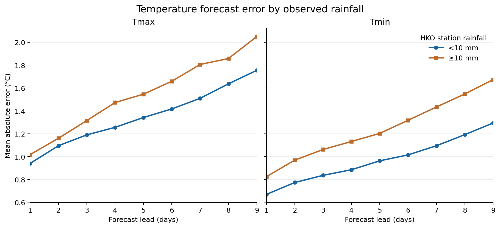
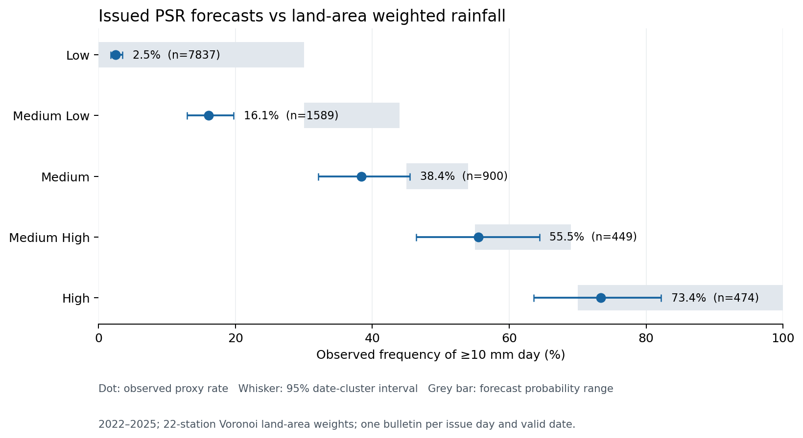

# Rainfall and HKO forecast verification, 2022–2025

## 1. Temperature forecast accuracy and observed rainfall

Complete HKO Headquarters Tmax, Tmin, and rainfall values were available on 1461 of 1461 calendar days. Rainfall groups use the station's realized daily total: at least 10 mm versus under 10 mm. One latest bulletin per issue day and valid date contributes each full-day lead from 1 to 9.

**Tmax:** MAE was 1.543°C on ≥10 mm days (1701 forecasts) and 1.349°C on <10 mm days (11402 forecasts). The rainy-day MAE was higher by 0.194°C (rainy minus other: +0.194°C; 95% valid-date cluster bootstrap interval +0.059 to +0.338°C). The interval excludes zero.
Higher rainy-day MAE appeared in 9/9 lead-day comparisons, 3/4 years, and 8/10 calendar months.

**Tmin:** MAE was 1.24°C on ≥10 mm days (1701 forecasts) and 0.969°C on <10 mm days (11402 forecasts). The rainy-day MAE was higher by 0.271°C (rainy minus other: +0.271°C; 95% valid-date cluster bootstrap interval +0.146 to +0.390°C). The interval excludes zero.
Higher rainy-day MAE appeared in 9/9 lead-day comparisons, 4/4 years, and 9/10 calendar months.

This is a retrospective association. Rainfall was observed after the forecast was issued, and season or other weather conditions can affect both rainfall and forecast error. It does not establish that rain caused the error difference.

## 2. Probability of Significant Rain calibration

The [HKO PSR labels](https://www.hko.gov.hk/en/wxinfo/currwx/fnd.htm) are **issued probability forecasts**, not an independent reference standard. HKO says that, among 100 forecasts labelled Medium Low, significant rain should occur about 30–44 times. The comparison below asks whether rainfall happened that often when HKO issued each label. It does not compare observations with an arbitrary target.

The observed event is a 22-station Voronoi land-area weighted daily rainfall estimate of at least 10 mm. The land mask is 1115.65 km². 1255 days had complete observations at all fixed stations; 0 days were excluded because Trace could change the event label. The same latest-bulletin rule and leads 1–9 apply.

| Issued PSR label | HKO forecast probability | Observed proxy frequency | 95% date-cluster interval | Forecasts | Unweighted proxy | Assessment under proxy |
| --- | --- | ---: | ---: | ---: | ---: | --- |
| Low | <30% | 2.5% | 1.8–3.5% | 7837 | 2.5% | point estimate within forecast range |
| Medium Low | 30-44% | 16.1% | 12.9–19.7% | 1589 | 16.5% | proxy frequency below forecast range; CI entirely below |
| Medium | 45-54% | 38.4% | 32.1–45.5% | 900 | 37.8% | point estimate outside forecast range; CI overlaps it |
| Medium High | 55-69% | 55.5% | 46.4–64.4% | 449 | 53.7% | point estimate within forecast range |
| High | >=70% | 73.4% | 63.6–82.2% | 474 | 72.8% | point estimate within forecast range |

**What the comparison shows:** Across 11,249 forecast cases, the proxy event occurred 1,395 times (12.4%). The frequency rises from 2.5% for Low to 73.4% for High. 2 of 5 category point estimates fall outside their forecast probability ranges; for 1, the entire 95% interval is outside. Observed rates rise with each higher PSR category.

The **Medium Low** forecast range is 30–44%, but the proxy event occurred in 16.1% of its forecast cases (95% interval 12.9–19.7%). That is evidence of a lower event frequency than the category forecasts *for this proxy and selected sample*. Low (<30%) and High (≥70%) are open-ended ranges; a rate inside either range alone cannot demonstrate forecast skill or precise calibration.

### By forecast lead

| PSR | Lead days | Event rate | 95% date-cluster interval | Forecasts |
| --- | --- | ---: | ---: | ---: |
| Low | 1-3 | 1.1% | 0.6–1.8% | 2618 |
| Low | 4-6 | 2.6% | 1.6–3.7% | 2573 |
| Low | 7-9 | 3.8% | 2.8–5.1% | 2646 |
| Medium Low | 1-3 | 9.4% | 6.0–13.5% | 393 |
| Medium Low | 4-6 | 15.0% | 11.2–19.7% | 532 |
| Medium Low | 7-9 | 20.9% | 16.6–25.4% | 664 |
| Medium | 1-3 | 28.7% | 21.7–36.5% | 275 |
| Medium | 4-6 | 34.8% | 27.3–42.8% | 322 |
| Medium | 7-9 | 51.2% | 43.3–59.8% | 303 |
| Medium High | 1-3 | 52.7% | 42.0–63.7% | 184 |
| Medium High | 4-6 | 59.8% | 48.6–70.6% | 169 |
| Medium High | 7-9 | 53.1% | 37.0–67.1% | 96 |
| High | 1-3 | 77.2% | 68.6–85.0% | 289 |
| High | 4-6 | 68.8% | 56.6–80.3% | 154 |
| High | 7-9 | 61.3% | 35.0–84.6% | 31 |

These rates compare the issued forecast categories with a declared station-based estimate of rainfall generally over Hong Kong. HKO does not prescribe this exact 22-station land-area target; therefore the result is conditional on our proxy and complete-day sample, and does not establish the Observatory's official calibration. The unweighted rates provide one target sensitivity check. Lead-group rates differ, so do not generalize a pooled rate to every forecast horizon.

## References and data provenance

The numerical results above were calculated from the read-only `course_project.project` database and the aggregate CSVs listed below. The external references define the forecasts, observation markers, geographic source data, and geometry method. They do not supply or independently verify the event rates in this report.

### Forecast and observation definitions

1. [Hong Kong Observatory, 9-day Weather Forecast, Note 3](https://www.hko.gov.hk/en/wxinfo/currwx/fnd.htm) — the PSR forecast event (daily rainfall of at least 10 mm generally over Hong Kong), five probability ranges, and the ‘per 100 forecasts’ interpretation.
2. [Hong Kong Observatory, Q & A for Probability of Significant Rain](https://www.hko.gov.hk/en/education/weather/rain/00568-Q-%26-A-for-Probability-of-Significant-Rain.html) — why PSR is a probability forecast and how the 10 mm threshold is defined.
3. [Hong Kong Observatory, Open Data API Documentation](https://data.weather.gov.hk/weatherAPI/doc/HKO_Open_Data_API_Documentation.pdf) — HKO daily maximum/minimum temperature data types and station-code definitions. The archived bulletin vintages used here come from the project database, not a current API response.
4. [Hong Kong Observatory, Daily Total Rainfall Data Dictionary](https://data.weather.gov.hk/weatherAPI/doc/data_dictionary_daily_total_rainfall.pdf) — `C` means complete data and `***` means unavailable.
5. [Hong Kong Observatory, The Year's Weather 2025](https://www.weather.gov.hk/en/wxinfo/pastwx/2025/ywx2025.htm) and [HKO daily rainfall display](https://www.hko.gov.hk/en/cis/dailyElement.htm?ele=RF&y=2022) — explain the `Trace` rainfall notation (less than 0.05 mm).
6. [COMP3522 database schema guide](../../../DATABASE_AGENT_GUIDE.md) — local record of the imported `project` tables, their grains, series codes, forecast vintages, station metadata, and provenance.

### Geographic sources and computation

7. [Home Affairs Department district-boundary dataset](https://data.gov.hk/en-data/dataset/hk-had-json1-hong-kong-administrative-boundaries) and [JSON used by the script](https://www.had.gov.hk/psi/hong-kong-administrative-boundaries/hksar_18_district_boundary.json) — the 18 district polygons; the raw district union includes sea.
8. [Lands Department topographic dataset metadata](https://portal.csdi.gov.hk/csdi-webpage/metadata/landsd_rcd_1637221775627_85634/html) and [CSDI HYDRPOLY feature layer](https://portal.csdi.gov.hk/server/rest/services/common/landsd_rcd_1637221775627_85634/FeatureServer/7) — source of `CLASS='EWB'` and `TYPE='SEF'` sea-fill polygons subtracted from the district union.
9. [Lands Department, Hong Kong Geographic Data 2026](https://www.landsd.gov.hk/en/resources/mapping-information/hk-geographic-data.html) and [Area of the HKSAR table](https://www.landsd.gov.hk/doc/en/mapping/ehkg/individual_PDF/AreaOfHKSAR_eHKG2026.pdf) — the published 1,114.57 km² land area used as a plausibility check on the constructed 1,115.65 km² land mask.
10. [Shapely `voronoi_polygons` documentation](https://shapely.readthedocs.io/en/latest/reference/shapely.voronoi_polygons.html) — ordered Voronoi cells for the 22 fixed station points.
11. [pyproj `Transformer` documentation](https://pyproj4.github.io/pyproj/stable/api/transformer.html) — longitude/latitude to metric Hong Kong projection conversion before area calculation.

### Reproducible local outputs

- Temperature: [overall differences](temperature_mae_difference_overall.csv), [group MAE and bias](temperature_error_by_rain_overall.csv), and [analysis code](../analyze_temperature_rain.py).
- PSR: [area-weighted category counts and rates](psr_area_calibration.csv), [lead-group rates](psr_area_calibration_by_lead_group.csv), [station area weights](psr_area_weights.csv), [unweighted sensitivity result](psr_calibration.csv), and [analysis code](../analyze_psr_area.py).
