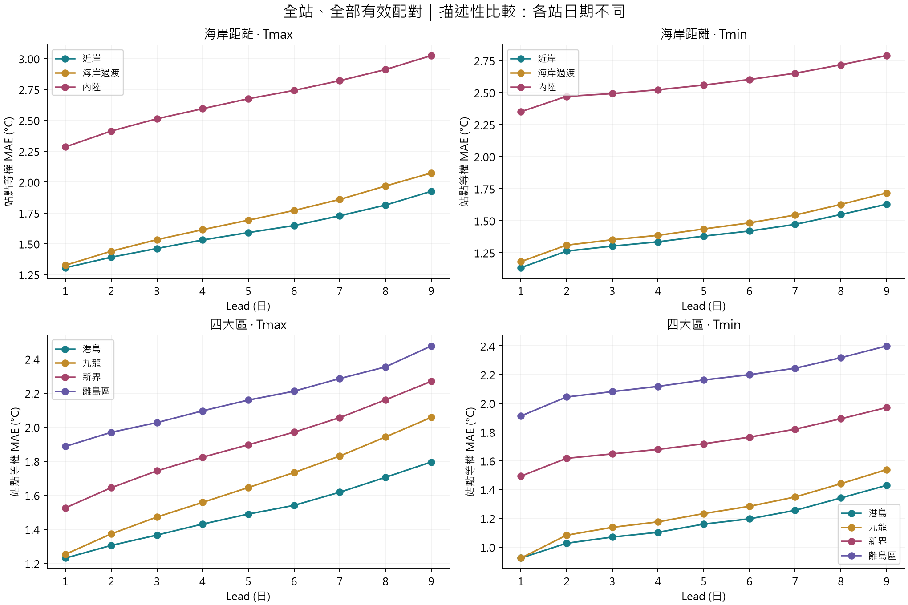
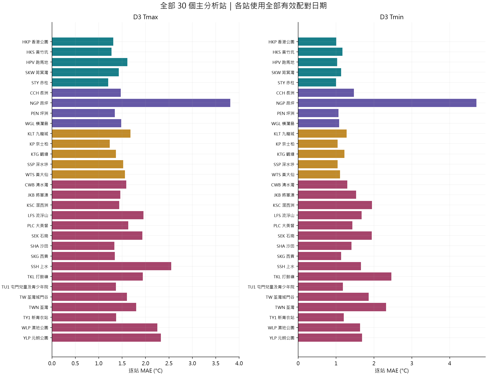

# Geographic temperature representativeness — all eligible stations

氣溫 × 海岸距離，以及氣溫 × 港島／九龍／新界／離島。2026-10-05 執行。

## 核心結果

**全部 30 個合資格站，沒有抽三站。** 全部 D1–D9、Tmax／Tmin 共 **670,865 筆有效站日預報配對**；同一站日出現在不同 lead 屬不同預報個案，不是獨立觀測日。完整逐筆壓縮檔留在 Git 倉庫外，避免把大型資料副本提交。

**資料限制本身就是結果：全站嚴格共同日期只有 24 日（1.64%）。** 主表保留每站全部有效資料作描述；不能在日期不一致的情況下宣稱地理因素造成預報更準。

## 全部站群

| 因素 | 組別 | 站數 | 全部站碼 |
| --- | --- | --- | --- |
| 海岸距離 | 近岸 | 10 | CCH;CWB;KSC;LFS;PEN;SKG;SKW;STY;TY1;WGL |
| 海岸距離 | 海岸過渡 | 15 | HKP;HKS;HPV;JKB;KLT;KP;KTG;PLC;SHA;SSP;TU1;TW;TWN;WLP;WTS |
| 海岸距離 | 內陸 | 5 | NGP;SEK;SSH;TKL;YLP |
| 四大區 | 港島 | 5 | HKP;HKS;HPV;SKW;STY |
| 四大區 | 九龍 | 5 | KLT;KP;KTG;SSP;WTS |
| 四大區 | 新界 | 16 | CWB;JKB;KSC;LFS;PLC;SEK;SHA;SKG;SSH;TKL;TU1;TW;TWN;TY1;WLP;YLP |
| 四大區 | 離島區 | 4 | CCH;NGP;PEN;WGL |

## D3 全部有效資料（站點等權，日期不同）

| 因素 | 組別 | 變數 | 站數 | 最少配對日／站 | 最多配對日／站 | MAE °C | RMSE °C | Bias °C |
| --- | --- | --- | --- | --- | --- | --- | --- | --- |
| 海岸距離 | 近岸 | Tmax | 10 | 997 | 1391 | 1.462 | 1.864 | 0.198 |
| 海岸距離 | 海岸過渡 | Tmax | 15 | 1064 | 1350 | 1.533 | 1.954 | -0.350 |
| 海岸距離 | 內陸 | Tmax | 5 | 756 | 1370 | 2.512 | 3.058 | -0.385 |
| 四大區 | 港島 | Tmax | 5 | 1234 | 1381 | 1.366 | 1.735 | 0.078 |
| 四大區 | 九龍 | Tmax | 5 | 1245 | 1350 | 1.472 | 1.873 | -0.405 |
| 四大區 | 新界 | Tmax | 16 | 1000 | 1370 | 1.743 | 2.198 | -0.476 |
| 四大區 | 離島區 | Tmax | 4 | 756 | 1391 | 2.027 | 2.687 | 1.016 |
| 海岸距離 | 近岸 | Tmin | 10 | 997 | 1391 | 1.301 | 1.630 | 1.041 |
| 海岸距離 | 海岸過渡 | Tmin | 15 | 1064 | 1350 | 1.351 | 1.713 | 1.010 |
| 海岸距離 | 內陸 | Tmin | 5 | 757 | 1370 | 2.492 | 3.125 | 2.348 |
| 四大區 | 港島 | Tmin | 5 | 1234 | 1381 | 1.069 | 1.363 | 0.559 |
| 四大區 | 九龍 | Tmin | 5 | 1245 | 1350 | 1.137 | 1.432 | 0.783 |
| 四大區 | 新界 | Tmin | 16 | 1000 | 1370 | 1.648 | 2.076 | 1.443 |
| 四大區 | 離島區 | Tmin | 4 | 757 | 1391 | 2.081 | 2.781 | 1.877 |

## D3 嚴格共同 24 日（稀疏診斷）

| 因素 | 組別 | 變數 | 站數 | MAE °C | RMSE °C | Bias °C |
| --- | --- | --- | --- | --- | --- | --- |
| 海岸距離 | 近岸 | Tmax | 10 | 1.640 | 2.045 | -0.016 |
| 海岸距離 | 海岸過渡 | Tmax | 15 | 1.809 | 2.226 | -0.661 |
| 海岸距離 | 內陸 | Tmax | 5 | 2.453 | 2.990 | -0.597 |
| 四大區 | 港島 | Tmax | 5 | 1.637 | 2.056 | -0.193 |
| 四大區 | 九龍 | Tmax | 5 | 1.823 | 2.184 | -0.724 |
| 四大區 | 新界 | Tmax | 16 | 1.884 | 2.345 | -0.711 |
| 四大區 | 離島區 | Tmax | 4 | 2.092 | 2.640 | 0.727 |
| 海岸距離 | 近岸 | Tmin | 10 | 1.208 | 1.498 | 0.805 |
| 海岸距離 | 海岸過渡 | Tmin | 15 | 1.298 | 1.643 | 0.888 |
| 海岸距離 | 內陸 | Tmin | 5 | 2.380 | 3.058 | 2.268 |
| 四大區 | 港島 | Tmin | 5 | 1.062 | 1.306 | 0.399 |
| 四大區 | 九龍 | Tmin | 5 | 1.075 | 1.297 | 0.653 |
| 四大區 | 新界 | Tmin | 16 | 1.561 | 2.021 | 1.324 |
| 四大區 | 離島區 | Tmin | 4 | 1.946 | 2.618 | 1.563 |

## 全部 30 站的 D3 明細

| 站碼 | 站名 | 海岸組 | 地區 | 海拔 m | 變數 | 配對日 | MAE °C | RMSE °C | Bias °C |
| --- | --- | --- | --- | --- | --- | --- | --- | --- | --- |
| CCH | 長洲 | 近岸 | 離島區 | 72 | Tmax | 1313 | 1.471 | 1.856 | 0.010 |
| CWB | 清水灣 | 近岸 | 新界 | 66 | Tmax | 1260 | 1.589 | 1.952 | 1.271 |
| HKP | 香港公園 | 海岸過渡 | 港島 | 26 | Tmax | 1284 | 1.312 | 1.663 | 0.553 |
| HKS | 黃竹坑 | 海岸過渡 | 港島 | 5 | Tmax | 1336 | 1.272 | 1.629 | -0.259 |
| HPV | 跑馬地 | 海岸過渡 | 港島 | 5 | Tmax | 1234 | 1.614 | 2.003 | -1.107 |
| JKB | 將軍澳 | 海岸過渡 | 新界 | 38 | Tmax | 1306 | 1.462 | 1.845 | -0.242 |
| KLT | 九龍城 | 海岸過渡 | 九龍 | 92 | Tmax | 1300 | 1.676 | 2.076 | -0.679 |
| KP | 京士柏 | 海岸過渡 | 九龍 | 65 | Tmax | 1245 | 1.234 | 1.620 | 0.141 |
| KSC | 滘西洲 | 近岸 | 新界 | 39 | Tmax | 1314 | 1.437 | 1.862 | 0.090 |
| KTG | 觀塘 | 海岸過渡 | 九龍 | 90 | Tmax | 1250 | 1.369 | 1.761 | 0.121 |
| LFS | 流浮山 | 近岸 | 新界 | 31 | Tmax | 1218 | 1.954 | 2.490 | -1.130 |
| NGP | 昂坪 | 內陸 | 離島區 | 593 | Tmax | 756 | 3.811 | 4.370 | 3.704 |
| PEN | 坪洲 | 近岸 | 離島區 | 34 | Tmax | 997 | 1.345 | 1.711 | -0.260 |
| PLC | 大美督 | 海岸過渡 | 新界 | 51 | Tmax | 1332 | 1.630 | 2.063 | -0.088 |
| SEK | 石崗 | 內陸 | 新界 | 16 | Tmax | 1028 | 1.930 | 2.352 | -1.164 |
| SHA | 沙田 | 海岸過渡 | 新界 | 6 | Tmax | 1337 | 1.333 | 1.701 | -0.351 |
| SKG | 西貢 | 近岸 | 新界 | 4 | Tmax | 1302 | 1.345 | 1.681 | 0.527 |
| SKW | 筲箕灣 | 近岸 | 港島 | 53 | Tmax | 1381 | 1.428 | 1.796 | 0.874 |
| SSH | 上水 | 內陸 | 新界 | 10 | Tmax | 1370 | 2.550 | 3.001 | -1.791 |
| SSP | 深水埗 | 海岸過渡 | 九龍 | 11 | Tmax | 1350 | 1.520 | 1.934 | -0.828 |
| STY | 赤柱 | 近岸 | 港島 | 31 | Tmax | 1253 | 1.202 | 1.545 | 0.330 |
| TKL | 打鼓嶺 | 內陸 | 新界 | 15 | Tmax | 1280 | 1.941 | 2.341 | -0.966 |
| TU1 | 屯門兒童及青少年院 | 海岸過渡 | 新界 | 28 | Tmax | 1285 | 1.365 | 1.749 | -0.325 |
| TW | 荃灣城門谷 | 海岸過渡 | 新界 | 35 | Tmax | 1064 | 1.602 | 2.026 | -0.646 |
| TWN | 荃灣 | 海岸過渡 | 新界 | 142 | Tmax | 1300 | 1.802 | 2.202 | 0.884 |
| TY1 | 新青衣站 | 近岸 | 新界 | 8 | Tmax | 1000 | 1.369 | 1.751 | -0.342 |
| WGL | 橫瀾島 | 近岸 | 離島區 | 56 | Tmax | 1391 | 1.479 | 1.848 | 0.608 |
| WLP | 濕地公園 | 海岸過渡 | 新界 | 4 | Tmax | 1301 | 2.250 | 2.777 | -1.638 |
| WTS | 黃大仙 | 海岸過渡 | 九龍 | 21 | Tmax | 1298 | 1.558 | 1.939 | -0.781 |
| YLP | 元朗公園 | 內陸 | 新界 | 8 | Tmax | 1235 | 2.329 | 2.764 | -1.709 |
| CCH | 長洲 | 近岸 | 離島區 | 72 | Tmin | 1313 | 1.469 | 1.768 | 1.352 |
| CWB | 清水灣 | 近岸 | 新界 | 66 | Tmin | 1260 | 1.296 | 1.614 | 1.164 |
| HKP | 香港公園 | 海岸過渡 | 港島 | 26 | Tmin | 1284 | 1.008 | 1.282 | 0.551 |
| HKS | 黃竹坑 | 海岸過渡 | 港島 | 5 | Tmin | 1336 | 1.171 | 1.504 | 0.631 |
| HPV | 跑馬地 | 海岸過渡 | 港島 | 5 | Tmin | 1234 | 1.031 | 1.317 | 0.185 |
| JKB | 將軍澳 | 海岸過渡 | 新界 | 38 | Tmin | 1306 | 1.528 | 1.843 | 1.354 |
| KLT | 九龍城 | 海岸過渡 | 九龍 | 92 | Tmin | 1300 | 1.277 | 1.586 | 1.041 |
| KP | 京士柏 | 海岸過渡 | 九龍 | 65 | Tmin | 1245 | 1.043 | 1.317 | 0.676 |
| KSC | 滘西洲 | 近岸 | 新界 | 39 | Tmin | 1314 | 1.946 | 2.269 | 1.882 |
| KTG | 觀塘 | 海岸過渡 | 九龍 | 90 | Tmin | 1250 | 1.220 | 1.515 | 0.964 |
| LFS | 流浮山 | 近岸 | 新界 | 31 | Tmin | 1218 | 1.674 | 2.018 | 1.555 |
| NGP | 昂坪 | 內陸 | 離島區 | 593 | Tmin | 757 | 4.707 | 4.914 | 4.702 |
| PEN | 坪洲 | 近岸 | 離島區 | 34 | Tmin | 997 | 1.064 | 1.344 | 0.687 |
| PLC | 大美督 | 海岸過渡 | 新界 | 51 | Tmin | 1332 | 1.432 | 1.754 | 1.307 |
| SEK | 石崗 | 內陸 | 新界 | 16 | Tmin | 1028 | 1.943 | 2.435 | 1.755 |
| SHA | 沙田 | 海岸過渡 | 新界 | 6 | Tmin | 1337 | 1.408 | 1.816 | 1.019 |
| SKG | 西貢 | 近岸 | 新界 | 4 | Tmin | 1302 | 1.135 | 1.433 | 0.776 |
| SKW | 筲箕灣 | 近岸 | 港島 | 53 | Tmin | 1381 | 1.136 | 1.427 | 0.845 |
| SSH | 上水 | 內陸 | 新界 | 10 | Tmin | 1370 | 1.658 | 2.111 | 1.429 |
| SSP | 深水埗 | 海岸過渡 | 九龍 | 11 | Tmin | 1350 | 1.040 | 1.328 | 0.575 |
| STY | 赤柱 | 近岸 | 港島 | 31 | Tmin | 1253 | 1.001 | 1.271 | 0.584 |
| TKL | 打鼓嶺 | 內陸 | 新界 | 15 | Tmin | 1280 | 2.462 | 3.112 | 2.393 |
| TU1 | 屯門兒童及青少年院 | 海岸過渡 | 新界 | 28 | Tmin | 1285 | 1.179 | 1.493 | 0.798 |
| TW | 荃灣城門谷 | 海岸過渡 | 新界 | 35 | Tmin | 1064 | 1.863 | 2.272 | 1.719 |
| TWN | 荃灣 | 海岸過渡 | 新界 | 142 | Tmin | 1300 | 2.319 | 2.618 | 2.286 |
| TY1 | 新青衣站 | 近岸 | 新界 | 8 | Tmin | 1000 | 1.203 | 1.502 | 0.796 |
| WGL | 橫瀾島 | 近岸 | 離島區 | 56 | Tmin | 1391 | 1.085 | 1.365 | 0.767 |
| WLP | 濕地公園 | 海岸過渡 | 新界 | 4 | Tmin | 1301 | 1.635 | 2.025 | 1.392 |
| WTS | 黃大仙 | 海岸過渡 | 九龍 | 21 | Tmin | 1298 | 1.105 | 1.392 | 0.659 |
| YLP | 元朗公園 | 內陸 | 新界 | 8 | Tmin | 1235 | 1.689 | 2.148 | 1.460 |

## 方法與解讀

- 研究期：2022-01-01 至 2025-12-31，1,461 個日曆日。D1–D9，Tmax／Tmin 分開，D0 不納入。
- 全部 30 個完整期 AWS 候選都納入，沒有 top-3、top-N 或按誤差選站。TMS、TC 依既定範圍排除；HKO 作基準，HKA 及搬站／非完整期站不進主分組。37 站的資格及缺值均保留在 station_inventory.csv。
- 海岸：近岸 ≤0.5 km；過渡 >0.5–2 km；內陸 >2 km。四大區按行政區分：港島、九龍、新界、離島區。離島不再併入新界，亦不是把所有地理上的島嶼都改列離島區。
- 每個目標日／發布日取最後存檔版本。Lead 為香港時間日曆差。只接受 C 且有數值的觀測，不補值、不以零代缺值。
- 全部有效資料（all_available）：每站用其全部有效配對日；組別 MAE = 各站 MAE 等權平均，RMSE = 各站 MSE 等權平均後開根號，Bias = 各站 Bias 等權平均。避免資料較多的站支配結果。另列 pooled_station_day_mae 供核對。
- 嚴格共同日期（strict_common）：同時要求 30 站、Tmax／Tmin、D1–D9 都有效。只有 24 日；每年分布為 4、3、4、13 日。這是稀疏診斷，並非四年天氣的充分代表樣本。
- 低海拔敏感度（lowland_available）：所有 <300 m 的合資格站，共 29 站。主分析仍保留昂坪 NGP（593 m）；只排除 TMS／TC 不等於排除全部高海拔站。
- 每個有正負號的誤差為 F−O。95% 區間使用 2,000 次、14 日循環日曆區塊重抽（seed 3522），同日所有站一起抽。區間只反映固定站點與缺值模式下的時間不確定性，不能修復各站日期不一致或 24 日樣本過少；未作多重比較校正。
- 當代海岸／行政區作固定地理代理；沒有重建 2022–2025 海岸變動。排除 TMS／TC 是在前一輪結果後按研究範圍修訂，不聲稱預先註冊。

## 觀測地域差異與 HKO baseline

本次另計算所有主站相對 HKO 同日實測的差異：`station_HKO_observed_offsets.csv` 列出 O_station−O_HKO 的均值、中位數、標準差及分位數。它是研究期觀測差異，不是長期氣候常值。

`HKO_error_decomposition.csv` 在相同三方有效日期核對：

`F − O_station = (F − O_HKO) + (O_HKO − O_station)`。

這個等式適用於 signed error／Bias，不能把 MAE 相加或相減。這些結果用來區分地域差異和基準預報誤差，沒有用全期觀測修正預報再在同一資料評分，亦沒有假裝建立官方逐站預報。

## 可以與不可以說的結論

1. 使用全站全部有效資料時，D3 描述性均值顯示近岸 MAE 小於內陸；港島小於新界。這與先前小站群的某些方向一致，但本次數值已改用全部站，不能沿用之前三站的數值或主張。
2. 所有站的觀測日期不同，所以以上不能當作完全控制天氣條件的公平排名。嚴格共同日期僅有 24 日，不足以對四年間穩定的地理排名給出強結論。
3. 離島有 4 站，含 593 m 的昂坪；其均值與其他地區的差異不能歸因於「離島」本身。應同看 29 站低海拔敏感度及逐站數據。
4. 「證據不足以支持穩定地區排名」是有效結果；不是證明地理因素沒有關聯。這裡也沒有足夠設計識別獨立或因果效果。
5. 研究對象是同一份公共預報的地方吻合程度，不是各站自己的預報能力；未取得本研究期 ARWF 歷史發布版本。人口、雨量、城市化、revision reliability 均不屬本目錄範圍。

## 結果索引

[互動全站檢視](report.html) · [完整站點分數](station_metrics.csv) · [完整組別分數](group_metrics.csv) · [配對覆蓋](pairing_coverage.csv) · [站點資格](station_inventory.csv) · [共同日期](strict_common_dates.csv) · [來源與版本](run_metadata.json) · [獨立核對](verification.json)
