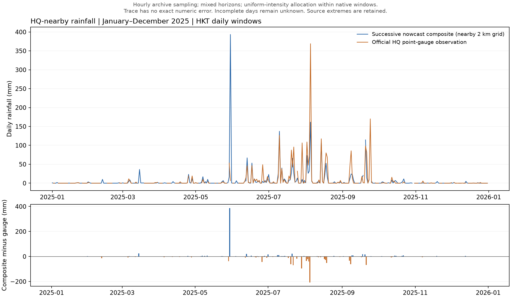

# HQ grid rainfall nowcast: preliminary 2025 findings

Task 1 supplementary track. Target dates: 2025-01-01–2025-12-31.
Results describe successive-nowcast daily composites against the HKO Headquarters point gauge.

## Findings

The replay has 8,754 hourly samples and 35,016 native windows.
Forecast coverage is complete for 360 of 365 days.
Five dates lack 396 minutes of forecast coverage.
All 365 gauge observations have completeness code C.
The 53 Trace observations retain [0, 0.05) mm bounds.

Exact losses use 308 complete numeric common cases.
All source extremes remain in the primary result.

## Concrete results

| Metric | Estimate | 95% block-bootstrap CI |
|---|---:|---:|
| MAE (mm) | 5.578 | [2.695, 9.255] |
| RMSE (mm) | 27.640 | [9.807, 43.563] |
| Bias (mm) | -1.221 | [-4.159, 2.182] |

Zero-rain baseline MAE is 7.753 mm on the same cases.
MAE skill relative to that baseline is 0.281.
Paired MAE gain is 2.175 mm, with 95% CI [-1.229, 5.230].
That CI crosses zero.
This comparison does not establish consistent improvement over the zero-rain baseline.
Persistence and climatology have not been evaluated in this track.

CIs use 2,000 circular seven-calendar-day block-bootstrap draws.
The random seed is 3522.

Including Trace bounds across all 360 complete days gives MAE [4.823, 4.830] mm.
This is a censoring envelope, not a confidence interval.
Its population differs from the 308-day numeric-only result.

## Monthly exploratory pattern

July MAE is 11.376 mm across 30 numeric cases.
August MAE is 13.874 mm across 31 numeric cases.
January MAE is 0.117 mm across 26 numeric cases.
These exploratory comparisons do not control weather difficulty or rainfall amount.
They do not establish a causal seasonal effect.

## Largest errors and source-spike influence

| Date | Composite mm | Gauge mm | Difference mm |
|---|---:|---:|---:|
| 2025-05-30 | 393.384 | 6.400 | +386.984 |
| 2025-08-05 | 161.442 | 368.900 | -207.458 |
| 2025-07-29 | 10.024 | 106.500 | -96.476 |
| 2025-07-22 | 26.036 | 95.700 | -69.664 |
| 2025-09-21 | 14.088 | 81.600 | -67.512 |

The 2025-05-30 source contains native half-hour values of 230.36 and 162.82 mm.
An independent redownload returned the same SHA-256.
The upstream cause remains unknown.
Both values remain in the primary result with diagnostic flags.
That day accounts for 63.6% of numeric squared error.

Post-hoc exclusion of that day gives MAE 4.336 mm and RMSE 16.693 mm.
This is an influence diagnostic, not evidence that the day is invalid.

## Coverage limitations

| Incomplete date | Missing minutes | Gauge original mm |
|---|---:|---|
| 2025-09-19 | 42 | 0.4 |
| 2025-09-24 | 96 | 170.1 |
| 2025-10-30 | 30 | Trace |
| 2025-12-06 | 210 | 0.0 |
| 2025-12-10 | 18 | 0.2 |

The excluded 2025-09-24 day has 170.1 mm of observed rain.
Missingness cannot be assumed independent of weather conditions.
Reported losses therefore describe complete common cases.

## Measurement and verification limits

The [method note](../README.md) defines availability, overlap handling and daily boundaries.
Within-window splits assume uniform rainfall intensity.
Grid-area rainfall and point-gauge rainfall have different spatial support.
The daily composite mixes horizons and forecast vintages.
It does not verify fixed-lead accuracy, nine-day PSR calibration or long-term improvement.

Raw hashes and HQ re-extraction were checked for all 8,754 samples.
The 181 January–June daily results exactly match the previous half-year replay.
Five pipeline checks passed.
Database observations matched the official CSV on all 365 dates.
Committed table counts, keys, date bounds and timestamps were checked.

These are preliminary descriptive findings, not a finalized benchmark.

## Annual comparison figure

